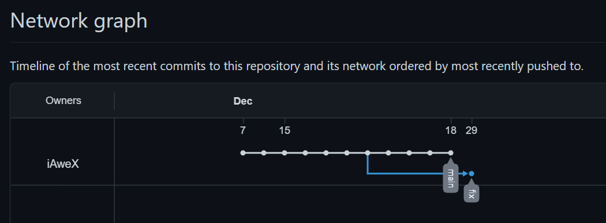

# Домашнее задание к занятию «2.2. Основы Git»

## Задание №1 – Знакомимся с gitlab и bitbucket

### Репозитарии в GitLab и Bitbucket

1. [GitHub](https://github.com/iAweX/DVPSPDC-3/)
2. [GitLab](https://gitlab.com/iAweX/DVPSPDC-3)
3. [Bitbucket](https://bitbucket.org/iawex/dvpspdc-3/)

Вывод команды `git remote -v`

```bash
09:13:39 AweX@HOST DVPSPDC-3 ±|main|→ git remote -v
origin  https://github.com/iAweX/DVPSPDC-3.git (fetch)
origin  https://github.com/iAweX/DVPSPDC-3.git (push)
```

Добавление GitLab и Bitbucket в качестве remote

```bash
09:20:14 AweX@HOST DVPSPDC-3 ±|main|→ git remote add gitlab https://gitlab.com/iAweX/DVPSPDC-3.git
09:24:19 AweX@HOST DVPSPDC-3 ±|main|→ git remote add bitbucket https://iAweX@bitbucket.org/iawex/dvpspdc-3.git
09:25:16 AweX@HOST DVPSPDC-3 ±|main|→ git push -u gitlab main
Enumerating objects: 7, done.
Counting objects: 100% (7/7), done.
Delta compression using up to 8 threads
Compressing objects: 100% (1/1), done.
Writing objects: 100% (4/4), 820 bytes | 820.00 KiB/s, done.
Total 4 (delta 2), reused 4 (delta 2), pack-reused 0
To https://gitlab.com/iAweX/DVPSPDC-3.git
   f584d52..fe6129d  main -> main
Branch 'main' set up to track remote branch 'main' from 'gitlab'.
09:26:35 AweX@HOST DVPSPDC-3 ±|main|→ git push -u bitbucket main
Enumerating objects: 7, done.
Counting objects: 100% (7/7), done.
Delta compression using up to 8 threads
Compressing objects: 100% (1/1), done.
Writing objects: 100% (4/4), 820 bytes | 820.00 KiB/s, done.
Total 4 (delta 2), reused 4 (delta 2), pack-reused 0
To https://bitbucket.org/iawex/dvpspdc-3.git
   f584d52..fe6129d  main -> main
Branch 'main' set up to track remote branch 'main' from 'bitbucket'.
09:27:50 AweX@HOST DVPSPDC-3 ±|main|→ git remote -v
bitbucket       https://iAweX@bitbucket.org/iawex/dvpspdc-3.git (fetch)
bitbucket       https://iAweX@bitbucket.org/iawex/dvpspdc-3.git (push)
gitlab  https://gitlab.com/iAweX/DVPSPDC-3.git (fetch)
gitlab  https://gitlab.com/iAweX/DVPSPDC-3.git (push)
origin  https://github.com/iAweX/DVPSPDC-3.git (fetch)
origin  https://github.com/iAweX/DVPSPDC-3.git (push)
09:28:07 AweX@HOST DVPSPDC-3 ±|main|→
```

## Задание №2 – Теги

Создание легковесного тега и push во все репозитарии

```bash
09:34:27 AweX@HOST DVPSPDC-3 ±|main|→ git tag v0.0 HEAD
09:35:10 AweX@HOST DVPSPDC-3 ±|main|→ git push bitbucket v0.0
Total 0 (delta 0), reused 0 (delta 0), pack-reused 0
To https://bitbucket.org/iawex/dvpspdc-3.git
 * [new tag]         v0.0 -> v0.0
09:40:00 AweX@HOST DVPSPDC-3 ±|main|→ git push gitlab v0.0
Total 0 (delta 0), reused 0 (delta 0), pack-reused 0
To https://gitlab.com/iAweX/DVPSPDC-3.git
 * [new tag]         v0.0 -> v0.0
09:40:13 AweX@HOST DVPSPDC-3 ±|main|→ git push origin v0.0
Total 0 (delta 0), reused 0 (delta 0), pack-reused 0
To https://github.com/iAweX/DVPSPDC-3.git
 * [new tag]         v0.0 -> v0.0
09:40:29 AweX@HOST DVPSPDC-3 ±|main|→
```

Создание аннотированного тэга и push во все репозитарии

```bash
09:48:22 AweX@HOST DVPSPDC-3 ±|main|→ git tag -a v0.1 HEAD -m "First Annotated Tag"
09:49:45 AweX@HOST DVPSPDC-3 ±|main|→ git tag
v0.0
v0.1
09:50:02 AweX@HOST DVPSPDC-3 ±|main|→ git push bitbucket v0.1
Enumerating objects: 1, done.
Counting objects: 100% (1/1), done.
Writing objects: 100% (1/1), 170 bytes | 170.00 KiB/s, done.
Total 1 (delta 0), reused 0 (delta 0), pack-reused 0
To https://bitbucket.org/iawex/dvpspdc-3.git
 * [new tag]         v0.1 -> v0.1
09:50:48 AweX@HOST DVPSPDC-3 ±|main|→ git push gitlab v0.1
Enumerating objects: 1, done.
Counting objects: 100% (1/1), done.
Writing objects: 100% (1/1), 170 bytes | 170.00 KiB/s, done.
Total 1 (delta 0), reused 0 (delta 0), pack-reused 0
To https://gitlab.com/iAweX/DVPSPDC-3.git
 * [new tag]         v0.1 -> v0.1
09:51:01 AweX@HOST DVPSPDC-3 ±|main|→ git push origin v0.1
Enumerating objects: 1, done.
Counting objects: 100% (1/1), done.
Writing objects: 100% (1/1), 170 bytes | 170.00 KiB/s, done.
Total 1 (delta 0), reused 0 (delta 0), pack-reused 0
To https://github.com/iAweX/DVPSPDC-3.git
 * [new tag]         v0.1 -> v0.1
09:51:13 AweX@HOST DVPSPDC-3 ±|main|→
```

Просмотр результатов

- GitHub


- GitLab


- Bitbucket


### Задание №3 – Ветки

```bash
11:54:38 AweX@HOST DVPSPDC-3 ±|main|→ git log --oneline
fe6129d (HEAD -> main, tag: v0.1, tag: v0.0, origin/main, gitlab/main, bitbucket/main) added .gitingnore description
f584d52 terraform .gitignore
58adb48 02-git-01-vcs
6c64e1b Moved and deleted
7735131 Prepare to delete and move
2f63be0 Added .gitignore
365b2e2 02-git-01-vcs
6d098dc fix errors in /README.md
eb2f754 02-git-01-vcs
5f23cb7 01-intro-01
bb807b6 Initial commit
11:51:37 AweX@HOST DVPSPDC-3 ±|main|→ git checkout main
Already on 'main'
Your branch is up to date with 'origin/main'.
11:51:41 AweX@HOST DVPSPDC-3 ±|main|→ git log --oneline | grep 'Prepare to delete and move'
7735131 Prepare to delete and move
11:55:38 AweX@HOST DVPSPDC-3 ±|main|→ git checkout 7735131
Note: switching to '7735131'.

You are in 'detached HEAD' state. You can look around, make experimental
changes and commit them, and you can discard any commits you make in this
state without impacting any branches by switching back to a branch.

If you want to create a new branch to retain commits you create, you may
do so (now or later) by using -c with the switch command. Example:

  git switch -c <new-branch-name>

Or undo this operation with:

  git switch -

Turn off this advice by setting config variable advice.detachedHead to false

HEAD is now at 7735131 Prepare to delete and move
11:56:11 AweX@HOST DVPSPDC-3 ±||→ git switch -c fix
Switched to a new branch 'fix'
11:56:43 AweX@HOST DVPSPDC-3 ±|fix|→ git push -u origin fix
Total 0 (delta 0), reused 0 (delta 0), pack-reused 0
remote:
remote: Create a pull request for 'fix' on GitHub by visiting:
remote:      https://github.com/iAweX/DVPSPDC-3/pull/new/fix
remote:
To https://github.com/iAweX/DVPSPDC-3.git
 * [new branch]      fix -> fix
Branch 'fix' set up to track remote branch 'fix' from 'origin'.
11:57:44 AweX@HOST DVPSPDC-3 ±|fix|→
```

- Схема коммитов после создания ветки fix


- Изменение файла /README.md и отправка изменений

```bash
11:57:44 AweX@HOST DVPSPDC-3 ±|fix|→ git status
On branch fix
Your branch is up to date with 'origin/fix'.

Changes not staged for commit:
  (use "git add <file>..." to update what will be committed)
  (use "git restore <file>..." to discard changes in working directory)
        modified:   README.md

no changes added to commit (use "git add" and/or "git commit -a")
12:11:47 AweX@HOST DVPSPDC-3 ±|fix ✗|→ git add README.md
12:12:17 AweX@HOST DVPSPDC-3 ±|fix ✗|→ git push -u origin fix
Everything up-to-date
Branch 'fix' set up to track remote branch 'fix' from 'origin'.
12:13:07 AweX@HOST DVPSPDC-3 ±|fix ✗|→ git commit -m 'New line in README.md'
[fix e6d362e] New line in README.md
 1 file changed, 2 insertions(+)
12:14:53 AweX@HOST DVPSPDC-3 ±|fix|→ git push -u origin fix
Enumerating objects: 5, done.
Counting objects: 100% (5/5), done.
Delta compression using up to 8 threads
Compressing objects: 100% (3/3), done.
Writing objects: 100% (3/3), 1000 bytes | 1000.00 KiB/s, done.
Total 3 (delta 1), reused 0 (delta 0), pack-reused 0
remote: Resolving deltas: 100% (1/1), completed with 1 local object.
To https://github.com/iAweX/DVPSPDC-3.git
   7735131..e6d362e  fix -> fix
Branch 'fix' set up to track remote branch 'fix' from 'origin'.
12:15:23 AweX@HOST DVPSPDC-3 ±|fix|→
```

- Схема коммитов после коммита изменений /README.md в ветку fix и отправки в origin/fix



- Вывод `git log` после коммита изменений /README.md в ветку fix

```bash
12:22:06 AweX@HOST DVPSPDC-3 ±|fix|→ git log --oneline --graph --all
* e6d362e (HEAD -> fix, origin/fix) New line in README.md
| * fe6129d (tag: v0.1, tag: v0.0, origin/main, gitlab/main, bitbucket/main, main) added .gitingnore description
| * f584d52 terraform .gitignore
| * 58adb48 02-git-01-vcs
| * 6c64e1b Moved and deleted
|/
* 7735131 Prepare to delete and move
* 2f63be0 Added .gitignore
* 365b2e2 02-git-01-vcs
* 6d098dc fix errors in /README.md
* eb2f754 02-git-01-vcs
* 5f23cb7 01-intro-01
* bb807b6 Initial commit
12:22:54 AweX@HOST DVPSPDC-3 ±|fix|→
```

### Задание №4 – Упрощаем себе жизнь

- Обзор PyCharm с открытым git


- PyCharm с Local Changes (в современной версии вкладка Commits)


- Commit и Push


- Окно PyCharm после коммита


