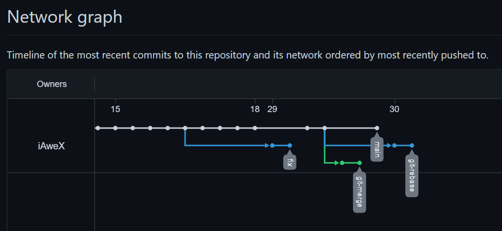
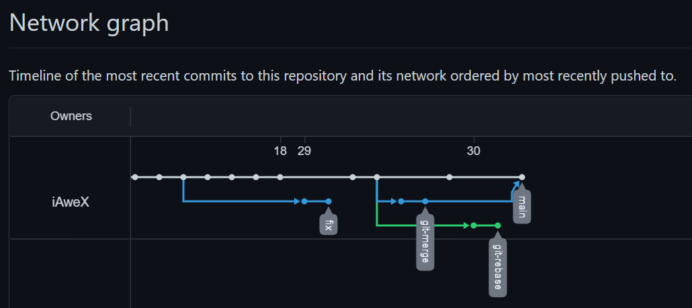
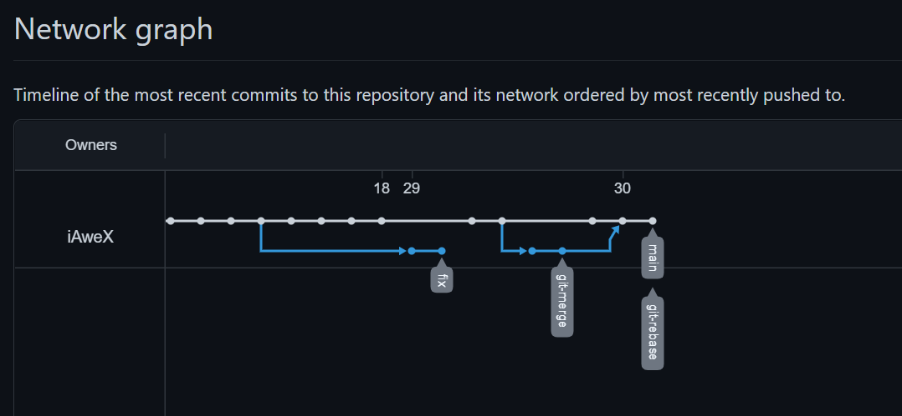

# Домашнее задание к занятию «2.3. Ветвления в Git»

## Задание №1 – Ветвление, merge и rebase

#### Создание merge.sh и rebase.sh и коммит в main

```diff
10:25:36 AweX@HOST branching ±|main ✗|→ git diff --cached
diff --git a/branching/merge.sh b/branching/merge.sh
new file mode 100644
index 0000000..2ccf873
--- /dev/null
+++ b/branching/merge.sh
@@ -0,0 +1,9 @@
+#!/bin/bash
+# display command line options
+
+count=1
+for param in "$*"; do
+    echo "\$* Parameter #$count = $param"
+    count=$(( $count + 1 ))
+done
+
diff --git a/branching/rebase.sh b/branching/rebase.sh
new file mode 100644
index 0000000..2ccf873
--- /dev/null
+++ b/branching/rebase.sh
@@ -0,0 +1,9 @@
+#!/bin/bash
+# display command line options
+
+count=1
+for param in "$*"; do
+    echo "\$* Parameter #$count = $param"
+    count=$(( $count + 1 ))
+done
+
10:27:48 AweX@HOST branching ±|main ✗|→
```

```bash
10:27:48 AweX@HOST branching ±|main ✗|→ git status
On branch main
Your branch is up to date with 'origin/main'.

Changes to be committed:
  (use "git restore --staged <file>..." to unstage)
        new file:   merge.sh
        new file:   rebase.sh

10:28:07 AweX@HOST branching ±|main ✗|→
10:28:07 AweX@HOST branching ±|main ✗|→ git commit -m "prepare for merge and rebase"
[main 5d58fae] prepare for merge and rebase
 2 files changed, 18 insertions(+)
 create mode 100644 branching/merge.sh
 create mode 100644 branching/rebase.sh
10:29:06 AweX@HOST branching ±|main|→
```

#### Создание ветки git-merge, изменение merge.sh и коммит

```bash
10:29:06 AweX@HOST branching ±|main|→ git branch -c git-merge
11:14:23 AweX@HOST branching ±|main|→ git checkout git-merge
Switched to branch 'git-merge'
Your branch is ahead of 'origin/main' by 1 commit.
  (use "git push" to publish your local commits)
11:18:44 AweX@HOST branching ±|git-merge|→ git status
On branch git-merge
Your branch is ahead of 'origin/main' by 1 commit.
  (use "git push" to publish your local commits)

Changes not staged for commit:
  (use "git add <file>..." to update what will be committed)
  (use "git restore <file>..." to discard changes in working directory)
        modified:   merge.sh

no changes added to commit (use "git add" and/or "git commit -a")
```

```diff
11:20:27 AweX@HOST branching ±|git-merge ✗|→ git diff
warning: LF will be replaced by CRLF in branching/merge.sh.
The file will have its original line endings in your working directory
diff --git a/branching/merge.sh b/branching/merge.sh
index 2ccf873..8cc475b 100644
--- a/branching/merge.sh
+++ b/branching/merge.sh
@@ -2,8 +2,8 @@
 # display command line options

 count=1
-for param in "$*"; do
-    echo "\$* Parameter #$count = $param"
+for param in "$@"; do
+    echo "\$@ Parameter #$count = $param"
     count=$(( $count + 1 ))
 done

11:20:35 AweX@HOST branching ±|git-merge ✗|→
```

```bash
11:24:45 AweX@HOST branching ±|git-merge ✗|→ git status
On branch git-merge
Your branch is ahead of 'origin/main' by 1 commit.
  (use "git push" to publish your local commits)

Changes not staged for commit:
  (use "git add <file>..." to update what will be committed)
  (use "git restore <file>..." to discard changes in working directory)
        modified:   merge.sh

no changes added to commit (use "git add" and/or "git commit -a")
11:25:46 AweX@HOST branching ±|git-merge ✗|→ git add merge.sh
warning: LF will be replaced by CRLF in branching/merge.sh.
The file will have its original line endings in your working directory
11:25:55 AweX@HOST branching ±|git-merge ✗|→ git commit -m "merge: @ instead *"
[git-merge e293134] merge: @ instead *
 1 file changed, 2 insertions(+), 2 deletions(-)
11:33:20 AweX@HOST branching ±|git-merge|→
```

#### Внесение еще одного изменения в merge.sh и коммит

```diff
11:33:20 AweX@HOST branching ±|git-merge|→ git diff
warning: LF will be replaced by CRLF in branching/merge.sh.
The file will have its original line endings in your working directory
diff --git a/branching/merge.sh b/branching/merge.sh
index 8cc475b..dfc25fe 100644
--- a/branching/merge.sh
+++ b/branching/merge.sh
@@ -2,8 +2,9 @@
 # display command line options

 count=1
-for param in "$@"; do
-    echo "\$@ Parameter #$count = $param"
+while [[ -n "$1" ]]; do
+    echo "Parameter #$count = $1"
     count=$(( $count + 1 ))
+    shift
 done

11:36:56 AweX@HOST branching ±|git-merge ✗|→
```

```bash
11:36:56 AweX@HOST branching ±|git-merge ✗|→ git add merge.sh
warning: LF will be replaced by CRLF in branching/merge.sh.
The file will have its original line endings in your working directory
11:37:47 AweX@HOST branching ±|git-merge ✗|→ git commit -m "merge: use shift"
[git-merge 8a52814] merge: use shift
 1 file changed, 3 insertions(+), 2 deletions(-)
11:38:18 AweX@HOST branching ±|git-merge|→
```

#### Отправка изменений в репозитарии

```bash
11:38:18 AweX@HOST branching ±|git-merge|→ git push -u bitbucket
Enumerating objects: 13, done.
Counting objects: 100% (13/13), done.
Delta compression using up to 8 threads
Compressing objects: 100% (12/12), done.
Writing objects: 100% (12/12), 3.14 KiB | 1.57 MiB/s, done.
Total 12 (delta 4), reused 0 (delta 0), pack-reused 0
remote:
remote: Create pull request for git-merge:
remote:   https://bitbucket.org/iawex/dvpspdc-3/pull-requests/new?source=git-merge&t=1
remote:
To https://bitbucket.org/iawex/dvpspdc-3.git
 * [new branch]      git-merge -> git-merge
Branch 'git-merge' set up to track remote branch 'git-merge' from 'bitbucket'.
11:41:24 AweX@HOST branching ±|git-merge|→ git push -u gitlab
Enumerating objects: 13, done.
Counting objects: 100% (13/13), done.
Delta compression using up to 8 threads
Compressing objects: 100% (12/12), done.
Writing objects: 100% (12/12), 3.14 KiB | 1.57 MiB/s, done.
Total 12 (delta 4), reused 0 (delta 0), pack-reused 0
remote:
remote: To create a merge request for git-merge, visit:
remote:   https://gitlab.com/iAweX/DVPSPDC-3/-/merge_requests/new?merge_request%5Bsource_branch%5D=git-merge
remote:
To https://gitlab.com/iAweX/DVPSPDC-3.git
 * [new branch]      git-merge -> git-merge
Branch 'git-merge' set up to track remote branch 'git-merge' from 'gitlab'.
11:41:41 AweX@HOST branching ±|git-merge|→ git push -u origin
Enumerating objects: 13, done.
Counting objects: 100% (13/13), done.
Delta compression using up to 8 threads
Compressing objects: 100% (12/12), done.
Writing objects: 100% (12/12), 3.14 KiB | 1.57 MiB/s, done.
Total 12 (delta 4), reused 0 (delta 0), pack-reused 0
remote: Resolving deltas: 100% (4/4), completed with 1 local object.
remote:
remote: Create a pull request for 'git-merge' on GitHub by visiting:
remote:      https://github.com/iAweX/DVPSPDC-3/pull/new/git-merge
remote:
To https://github.com/iAweX/DVPSPDC-3.git
 * [new branch]      git-merge -> git-merge
Branch 'git-merge' set up to track remote branch 'git-merge' from 'origin'.
11:41:56 AweX@HOST branching ±|git-merge|→
```

#### Изменения в main и отправка в репозитарий

```bash
11:41:56 AweX@HOST branching ±|git-merge|→ git checkout main
Switched to branch 'main'
Your branch is ahead of 'origin/main' by 1 commit.
  (use "git push" to publish your local commits)
11:45:13 AweX@HOST branching ±|main|→ git status
On branch main
Your branch is ahead of 'origin/main' by 1 commit.
  (use "git push" to publish your local commits)

Changes not staged for commit:
  (use "git add <file>..." to update what will be committed)
  (use "git restore <file>..." to discard changes in working directory)
        modified:   rebase.sh

no changes added to commit (use "git add" and/or "git commit -a")
11:49:55 AweX@HOST branching ±|main ✗|→ git add rebase.sh
warning: LF will be replaced by CRLF in branching/rebase.sh.
The file will have its original line endings in your working directory
```

```diff
11:41:56 AweX@HOST branching ±|git-merge|→ git checkout main
Switched to branch 'main'
Your branch is ahead of 'origin/main' by 1 commit.
  (use "git push" to publish your local commits)
11:45:13 AweX@HOST branching ±|main|→ git status
On branch main
Your branch is ahead of 'origin/main' by 1 commit.
  (use "git push" to publish your local commits)

Changes not staged for commit:
  (use "git add <file>..." to update what will be committed)
  (use "git restore <file>..." to discard changes in working directory)
        modified:   rebase.sh

no changes added to commit (use "git add" and/or "git commit -a")
11:49:55 AweX@HOST branching ±|main ✗|→ git add rebase.sh
warning: LF will be replaced by CRLF in branching/rebase.sh.
The file will have its original line endings in your working directory
```

```bash
11:51:08 AweX@HOST branching ±|main ✗|→ git commit -m "change rebase.sh in main"
[main a2487db] change rebase.sh in main
 1 file changed, 4 insertions(+), 2 deletions(-)
11:52:11 AweX@HOST branching ±|main|→ git push -u bitbucket
Enumerating objects: 7, done.
Counting objects: 100% (7/7), done.
Delta compression using up to 8 threads
Compressing objects: 100% (4/4), done.
Writing objects: 100% (4/4), 1.04 KiB | 1.04 MiB/s, done.
Total 4 (delta 2), reused 0 (delta 0), pack-reused 0
To https://bitbucket.org/iawex/dvpspdc-3.git
   6dbeabc..a2487db  main -> main
Branch 'main' set up to track remote branch 'main' from 'bitbucket'.
11:52:52 AweX@HOST branching ±|main|→ git push -u gitlab
Enumerating objects: 7, done.
Counting objects: 100% (7/7), done.
Delta compression using up to 8 threads
Compressing objects: 100% (4/4), done.
Writing objects: 100% (4/4), 1.04 KiB | 1.04 MiB/s, done.
Total 4 (delta 2), reused 0 (delta 0), pack-reused 0
To https://gitlab.com/iAweX/DVPSPDC-3.git
   6dbeabc..a2487db  main -> main
Branch 'main' set up to track remote branch 'main' from 'gitlab'.
11:53:05 AweX@HOST branching ±|main|→ git push -u origin
Enumerating objects: 7, done.
Counting objects: 100% (7/7), done.
Delta compression using up to 8 threads
Compressing objects: 100% (4/4), done.
Writing objects: 100% (4/4), 1.04 KiB | 1.04 MiB/s, done.
Total 4 (delta 2), reused 0 (delta 0), pack-reused 0
remote: Resolving deltas: 100% (2/2), completed with 2 local objects.
To https://github.com/iAweX/DVPSPDC-3.git
   6dbeabc..a2487db  main -> main
Branch 'main' set up to track remote branch 'main' from 'origin'.
11:53:24 AweX@HOST branching ±|main|→
```

#### Подготовка файла rebase.sh и 2-х коммитов

```bash
11:55:16 AweX@HOST branching ±|main|→ git log --oneline --grep "prepare for merge and rebase"
5d58fae prepare for merge and rebase
11:55:34 AweX@HOST branching ±|main|→ git checkout 5d58fae
Note: switching to '5d58fae'.

You are in 'detached HEAD' state. You can look around, make experimental
changes and commit them, and you can discard any commits you make in this
state without impacting any branches by switching back to a branch.

If you want to create a new branch to retain commits you create, you may
do so (now or later) by using -c with the switch command. Example:

  git switch -c <new-branch-name>

Or undo this operation with:

  git switch -

Turn off this advice by setting config variable advice.detachedHead to false

HEAD is now at 5d58fae prepare for merge and rebase
11:56:16 AweX@HOST branching ±||→
11:56:16 AweX@HOST branching ±||→ git switch -c git-rebase
Switched to a new branch 'git-rebase'
11:59:15 AweX@HOST branching ±|git-rebase|→
```

```diff
11:59:15 AweX@HOST branching ±|git-rebase|→ git diff
diff --git a/branching/rebase.sh b/branching/rebase.sh
index 2ccf873..f005b1c 100644
--- a/branching/rebase.sh
+++ b/branching/rebase.sh
@@ -2,8 +2,10 @@
 # display command line options

 count=1
-for param in "$*"; do
-    echo "\$* Parameter #$count = $param"
+for param in "$@"; do
+    echo "Parameter: $param"
     count=$(( $count + 1 ))
 done

+echo "====="
+
12:00:56 AweX@HOST branching ±|git-rebase ✗|→
```

```bash
12:00:56 AweX@HOST branching ±|git-rebase ✗|→ git add rebase.sh
12:03:49 AweX@HOST branching ±|git-rebase ✗|→ git commit -m "git-rebase 1"
[git-rebase d7f9500] git-rebase 1
 1 file changed, 4 insertions(+), 2 deletions(-)
12:04:10 AweX@HOST branching ±|git-rebase|→ git push -u bitbucket
Enumerating objects: 7, done.
Counting objects: 100% (7/7), done.
Delta compression using up to 8 threads
Compressing objects: 100% (4/4), done.
Writing objects: 100% (4/4), 1.03 KiB | 1.03 MiB/s, done.
Total 4 (delta 2), reused 0 (delta 0), pack-reused 0
remote:
remote: Create pull request for git-rebase:
remote:   https://bitbucket.org/iawex/dvpspdc-3/pull-requests/new?source=git-rebase&t=1
remote:
To https://bitbucket.org/iawex/dvpspdc-3.git
 * [new branch]      git-rebase -> git-rebase
Branch 'git-rebase' set up to track remote branch 'git-rebase' from 'bitbucket'.
12:04:42 AweX@HOST branching ±|git-rebase|→ git push -u gitlab
Enumerating objects: 7, done.
Counting objects: 100% (7/7), done.
Delta compression using up to 8 threads
Compressing objects: 100% (4/4), done.
Writing objects: 100% (4/4), 1.03 KiB | 1.03 MiB/s, done.
Total 4 (delta 2), reused 0 (delta 0), pack-reused 0
remote:
remote: To create a merge request for git-rebase, visit:
remote:   https://gitlab.com/iAweX/DVPSPDC-3/-/merge_requests/new?merge_request%5Bsource_branch%5D=git-rebase
remote:
To https://gitlab.com/iAweX/DVPSPDC-3.git
 * [new branch]      git-rebase -> git-rebase
Branch 'git-rebase' set up to track remote branch 'git-rebase' from 'gitlab'.
12:04:55 AweX@HOST branching ±|git-rebase|→ git push -u origin
Enumerating objects: 7, done.
Counting objects: 100% (7/7), done.
Delta compression using up to 8 threads
Compressing objects: 100% (4/4), done.
Writing objects: 100% (4/4), 1.03 KiB | 1.03 MiB/s, done.
Total 4 (delta 2), reused 0 (delta 0), pack-reused 0
remote: Resolving deltas: 100% (2/2), completed with 2 local objects.
remote:
remote: Create a pull request for 'git-rebase' on GitHub by visiting:
remote:      https://github.com/iAweX/DVPSPDC-3/pull/new/git-rebase
remote:
To https://github.com/iAweX/DVPSPDC-3.git
 * [new branch]      git-rebase -> git-rebase
Branch 'git-rebase' set up to track remote branch 'git-rebase' from 'origin'.
12:05:04 AweX@HOST branching ±|git-rebase|→
```

```diff
12:05:04 AweX@HOST branching ±|git-rebase|→ git diff
diff --git a/branching/rebase.sh b/branching/rebase.sh
index f005b1c..b0451d6 100644
--- a/branching/rebase.sh
+++ b/branching/rebase.sh
@@ -3,7 +3,7 @@

 count=1
 for param in "$@"; do
-    echo "Parameter: $param"
+    echo "Next parameter: $param"
     count=$(( $count + 1 ))
 done

12:09:12 AweX@HOST branching ±|git-rebase ✗|→
```

```bash
12:09:12 AweX@HOST branching ±|git-rebase ✗|→ git add rebase.sh
12:10:09 AweX@HOST branching ±|git-rebase ✗|→ git commit -m "git-rebase 2"
[git-rebase 02ec2a8] git-rebase 2
 1 file changed, 1 insertion(+), 1 deletion(-)
12:10:37 AweX@HOST branching ±|git-rebase|→ git push bitbucket
Enumerating objects: 7, done.
Counting objects: 100% (7/7), done.
Delta compression using up to 8 threads
Compressing objects: 100% (4/4), done.
Writing objects: 100% (4/4), 1.01 KiB | 1.01 MiB/s, done.
Total 4 (delta 2), reused 0 (delta 0), pack-reused 0
remote:
remote: Create pull request for git-rebase:
remote:   https://bitbucket.org/iawex/dvpspdc-3/pull-requests/new?source=git-rebase&t=1
remote:
To https://bitbucket.org/iawex/dvpspdc-3.git
   d7f9500..02ec2a8  git-rebase -> git-rebase
12:11:07 AweX@HOST branching ±|git-rebase|→ git push gitlab
Enumerating objects: 7, done.
Counting objects: 100% (7/7), done.
Delta compression using up to 8 threads
Compressing objects: 100% (4/4), done.
Writing objects: 100% (4/4), 1.01 KiB | 1.01 MiB/s, done.
Total 4 (delta 2), reused 0 (delta 0), pack-reused 0
remote:
remote: To create a merge request for git-rebase, visit:
remote:   https://gitlab.com/iAweX/DVPSPDC-3/-/merge_requests/new?merge_request%5Bsource_branch%5D=git-rebase
remote:
To https://gitlab.com/iAweX/DVPSPDC-3.git
   d7f9500..02ec2a8  git-rebase -> git-rebase
12:11:18 AweX@HOST branching ±|git-rebase|→ git push origin
Enumerating objects: 7, done.
Counting objects: 100% (7/7), done.
Delta compression using up to 8 threads
Compressing objects: 100% (4/4), done.
Writing objects: 100% (4/4), 1.01 KiB | 1.01 MiB/s, done.
Total 4 (delta 2), reused 0 (delta 0), pack-reused 0
remote: Resolving deltas: 100% (2/2), completed with 2 local objects.
To https://github.com/iAweX/DVPSPDC-3.git
   d7f9500..02ec2a8  git-rebase -> git-rebase
12:11:26 AweX@HOST branching ±|git-rebase|→
```

#### Промежуточный результат



#### Merge

Сливаем ветку git-merge в main и отправляем изменения в репозиторий

```bash
12:11:26 AweX@HOST branching ±|git-rebase|→ git checkout main
Switched to branch 'main'
Your branch is up to date with 'origin/main'.
12:19:10 AweX@HOST branching ±|main|→ git merge git-merge
Merge made by the 'ort' strategy.
 branching/merge.sh | 5 +++--
 1 file changed, 3 insertions(+), 2 deletions(-)
12:19:24 AweX@HOST branching ±|main|→ git push
Enumerating objects: 7, done.
Counting objects: 100% (7/7), done.
Delta compression using up to 8 threads
Compressing objects: 100% (3/3), done.
Writing objects: 100% (3/3), 1.00 KiB | 1.00 MiB/s, done.
Total 3 (delta 1), reused 0 (delta 0), pack-reused 0
remote: Resolving deltas: 100% (1/1), completed with 1 local object.
To https://github.com/iAweX/DVPSPDC-3.git
   a2487db..20b67e5  main -> main
12:20:08 AweX@HOST branching ±|main|→
```

- Результат



#### Rebase

```bash
12:41:07 AweX@HOST branching ±|main|→ git checkout git-rebase
Switched to branch 'git-rebase'
Your branch is up to date with 'origin/git-rebase'.
12:41:51 AweX@HOST branching ±|git-rebase|→ git rebase -i main
Auto-merging branching/rebase.sh
CONFLICT (content): Merge conflict in branching/rebase.sh
error: could not apply d7f9500... git-rebase 1
hint: Resolve all conflicts manually, mark them as resolved with
hint: "git add/rm <conflicted_files>", then run "git rebase --continue".
hint: You can instead skip this commit: run "git rebase --skip".
hint: To abort and get back to the state before "git rebase", run "git rebase --abort".
Could not apply d7f9500... git-rebase 1
12:45:04 AweX@HOST branching ±| ✗|→ vi rebase.sh
12:50:02 AweX@HOST branching ±| ✗|→ git add rebase.sh
12:51:39 AweX@HOST branching ±||→ git rebase --continue
Auto-merging branching/rebase.sh
CONFLICT (content): Merge conflict in branching/rebase.sh
error: could not apply 02ec2a8... git-rebase 2
hint: Resolve all conflicts manually, mark them as resolved with
hint: "git add/rm <conflicted_files>", then run "git rebase --continue".
hint: You can instead skip this commit: run "git rebase --skip".
hint: To abort and get back to the state before "git rebase", run "git rebase --abort".
Could not apply 02ec2a8... git-rebase 2
12:51:53 AweX@HOST branching ±| ✗|→ vi rebase.sh
12:54:29 AweX@HOST branching ±| ✗|→ git add rebase.sh
12:54:35 AweX@HOST branching ±| ✗|→ git merge --continue
fatal: There is no merge in progress (MERGE_HEAD missing).
12:54:54 AweX@HOST branching ±| ✗|→ git rebase --continue
[detached HEAD acf13c9] git-rebase 2
 1 file changed, 1 insertion(+), 1 deletion(-)
Successfully rebased and updated refs/heads/git-rebase.
12:55:36 AweX@HOST branching ±|git-rebase|→ git push -u origin git-rebase
To https://github.com/iAweX/DVPSPDC-3.git
 ! [rejected]        git-rebase -> git-rebase (non-fast-forward)
error: failed to push some refs to 'https://github.com/iAweX/DVPSPDC-3.git'
hint: Updates were rejected because the tip of your current branch is behind
hint: its remote counterpart. Integrate the remote changes (e.g.
hint: 'git pull ...') before pushing again.
hint: See the 'Note about fast-forwards' in 'git push --help' for details.
12:57:20 AweX@HOST branching ±|git-rebase|→ git push -u origin git-rebase -f
Enumerating objects: 7, done.
Counting objects: 100% (7/7), done.
Delta compression using up to 8 threads
Compressing objects: 100% (4/4), done.
Writing objects: 100% (4/4), 1.02 KiB | 1.02 MiB/s, done.
Total 4 (delta 2), reused 0 (delta 0), pack-reused 0
remote: Resolving deltas: 100% (2/2), completed with 2 local objects.
To https://github.com/iAweX/DVPSPDC-3.git
 + 02ec2a8...acf13c9 git-rebase -> git-rebase (forced update)
Branch 'git-rebase' set up to track remote branch 'git-rebase' from 'origin'.
12:58:21 AweX@HOST branching ±|git-rebase|→ git checkout main
Switched to branch 'main'
Your branch is up to date with 'origin/main'.
01:00:04 AweX@HOST branching ±|main|→ git merge git-rebase
Updating 20b67e5..acf13c9
Fast-forward
 branching/rebase.sh | 2 +-
 1 file changed, 1 insertion(+), 1 deletion(-)
01:00:59 AweX@HOST branching ±|main|→
```

### Результат


