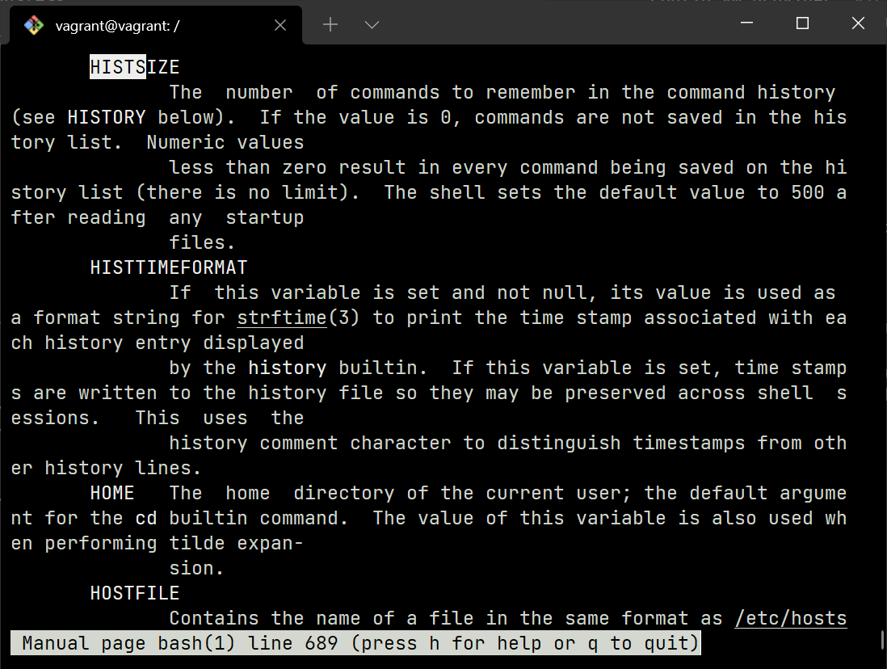

# Домашнее задание к занятию "3.1. Работа в терминале, лекция 1"

#### Необходимое программное обеспечение

```bash
06:08:29 AweX@HOST DVPSPDC-3 ±|main|→ winget list | grep "VirtualBox\|Vagrant\|Terminal"
Windows Terminal                        Microsoft.WindowsTerminal                1.11.3471.0                     winget
Oracle VM VirtualBox                    Oracle.VirtualBox                        6.1.30                          winget
Vagrant                                 Hashicorp.Vagrant                        2.2.19                          winget
08:04:34 AweX@HOST DVPSPDC-3 ±|main|→
```

Перечисленные проблемы не актульны для конфигурации, где выполняется ДЗ 

#### Настройка и запуск VM

```commandline
C:\Users\AweX>cd .vagrant

C:\Users\AweX\.vagrant>vagrant init
A `Vagrantfile` has been placed in this directory. You are now
ready to `vagrant up` your first virtual environment! Please read
the comments in the Vagrantfile as well as documentation on
`vagrantup.com` for more information on using Vagrant.

C:\Users\AweX\.vagrant>
```

```bash
08:10:01 AweX@HOST .vagrant → vi Vagrantfile
08:14:34 AweX@HOST .vagrant → cat Vagrantfile
 Vagrant.configure("2") do |config|
        config.vm.box = "bento/ubuntu-20.04"
 end
08:14:43 AweX@HOST .vagrant →
```

```commandline
C:\Users\AweX\.vagrant>vagrant up
Bringing machine 'default' up with 'virtualbox' provider...
==> default: Box 'bento/ubuntu-20.04' could not be found. Attempting to find and install...
    default: Box Provider: virtualbox
    default: Box Version: >= 0
==> default: Loading metadata for box 'bento/ubuntu-20.04'
    default: URL: https://vagrantcloud.com/bento/ubuntu-20.04
==> default: Adding box 'bento/ubuntu-20.04' (v202112.19.0) for provider: virtualbox
    default: Downloading: https://vagrantcloud.com/bento/boxes/ubuntu-20.04/versions/202112.19.0/providers/virtualbox.box
    default:
==> default: Successfully added box 'bento/ubuntu-20.04' (v202112.19.0) for 'virtualbox'!
==> default: Importing base box 'bento/ubuntu-20.04'...
==> default: Matching MAC address for NAT networking...
==> default: Checking if box 'bento/ubuntu-20.04' version '202112.19.0' is up to date...
==> default: Setting the name of the VM: vagrant_default_1640884598017_29036
Vagrant is currently configured to create VirtualBox synced folders with
the `SharedFoldersEnableSymlinksCreate` option enabled. If the Vagrant
guest is not trusted, you may want to disable this option. For more
information on this option, please refer to the VirtualBox manual:

  https://www.virtualbox.org/manual/ch04.html#sharedfolders

This option can be disabled globally with an environment variable:

  VAGRANT_DISABLE_VBOXSYMLINKCREATE=1

or on a per folder basis within the Vagrantfile:

  config.vm.synced_folder '/host/path', '/guest/path', SharedFoldersEnableSymlinksCreate: false
==> default: Clearing any previously set network interfaces...
==> default: Preparing network interfaces based on configuration...
    default: Adapter 1: nat
==> default: Forwarding ports...
    default: 22 (guest) => 2222 (host) (adapter 1)
==> default: Booting VM...
==> default: Waiting for machine to boot. This may take a few minutes...
    default: SSH address: 127.0.0.1:2222
    default: SSH username: vagrant
    default: SSH auth method: private key
    default:
    default: Vagrant insecure key detected. Vagrant will automatically replace
    default: this with a newly generated keypair for better security.
    default:
    default: Inserting generated public key within guest...
    default: Removing insecure key from the guest if it's present...
    default: Key inserted! Disconnecting and reconnecting using new SSH key...
==> default: Machine booted and ready!
==> default: Checking for guest additions in VM...
==> default: Mounting shared folders...
    default: /vagrant => C:/Users/AweX/.vagrant

C:\Users\AweX\.vagrant>
C:\Users\AweX\.vagrant>vagrant halt
==> default: Attempting graceful shutdown of VM...

C:\Users\AweX\.vagrant>
```

#### Ознакомление с графическим интерфейсом VirtualBox


#### Изменение параметров vm

```bash
09:55:15 AweX@HOST ~ → cat ~/.vagrant/Vagrantfile
 Vagrant.configure("2") do |config|
        config.vm.box = "bento/ubuntu-20.04"
        config.vm.provider "virtualbox" do |v|
                v.name = "Ubuntu-Netology"
                v.memory = 2048
                v.cpus = 2
        end
 end
09:55:31 AweX@HOST ~ →
```

#### Ознакомление с разделами `man bash`

- Переменная HISTSIZE задает длину журнала.
  


- `ignoreboth` говорит использовать обе опции `ignorespace` и `ignoredups`, то есть если для `HISTCONTROL` указать значение `ignoreboth`, то в истории не будут сохранятся строки начинающиеся с пробелов и строки совпадающие с последней командой (строка 668, man bash, Ubuntu 20.04.3 LTS)

#### Применение `{}`

`{}` применяются для генерации произволных строк. Конструкция `{x..y}` задает последовтельность для генерации от x до y. (строка 869, man bash, Ubuntu 20.04.3 LTS)

#### Создание 100000 и 300000 файлов.

```bash
vagrant@vagrant:~/tmp$ touch {1..100000}
```

Создать 300000 файлов не получится, мы упремся в лимиты ARG_MAX. Причины хорошо описаны в [статье](https://www.baeldung.com/linux/argument-list-too-long-error) 
```bash
vagrant@vagrant:~/tmp$ touch {1..300000}
-bash: /usr/bin/touch: Argument list too long
```

#### Конструкция `[[ -d /tmp ]]`

Указанная конструкция вернёт значение `true` так как директория /tmp существует (строки 1460 и 1479 в `man bash`). При выполнении в `bash`, exit code будет 0 (успешное завершение команды)

```bash
vagrant@vagrant:/$ [[ -d /tmp ]]
vagrant@vagrant:/$ echo $?
0
vagrant@vagrant:/$
```

#### Изменение вывода `type -a bash`

```bash
vagrant@vagrant:/$ type -a bash
bash is /usr/bin/bash
bash is /bin/bash
vagrant@vagrant:/$ mkdir /tmp/new_path_directory/
vagrant@vagrant:/$ cp /usr/bin/bash /tmp/new_path_directory/
vagrant@vagrant:/$ PATH=/tmp/new_path_directory/:$PATH
vagrant@vagrant:/$ type -a bash
bash is /tmp/new_path_directory/bash
bash is /usr/bin/bash
bash is /bin/bash
vagrant@vagrant:/$
```

#### Отличия `batch` и `at` (`man at`)

`at` Выполняет команды в указанное время.

`batch` Выполняет команды, когда это позволяет уровень загрузки системы. Иными словами, когда средняя загрузка падает ниже установленного значения.

#### Завершение работы виртуальной машины

```bash
01:52:03 AweX@HOST .vagrant → vagrant halt
==> default: Attempting graceful shutdown of VM...
01:52:47 AweX@HOST .vagrant → vagrant status
Current machine states:

default                   poweroff (virtualbox)

The VM is powered off. To restart the VM, simply run `vagrant up`
01:53:09 AweX@HOST .vagrant →
```